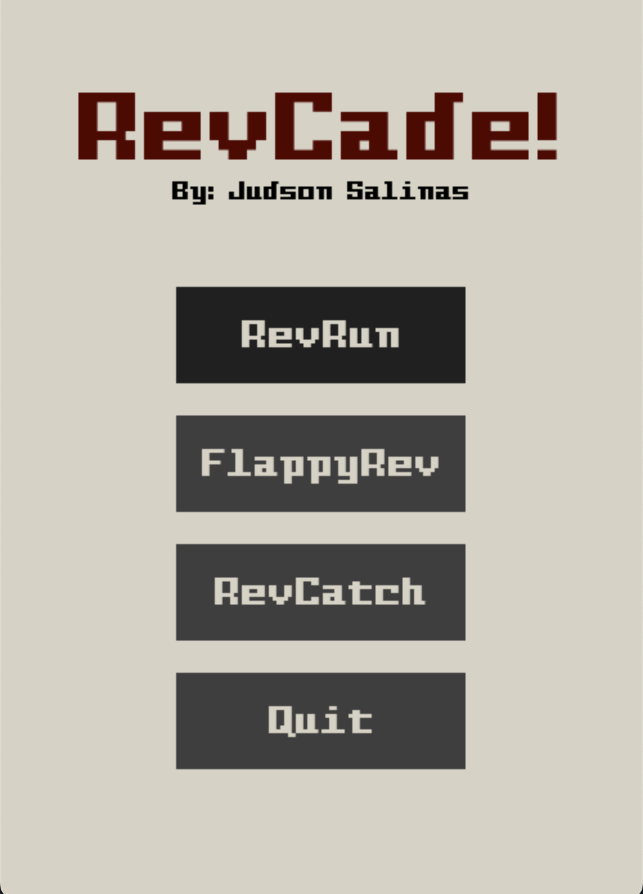
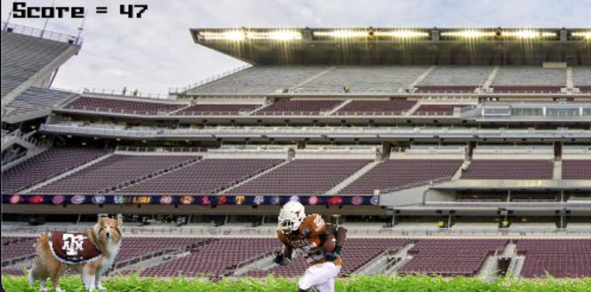

# RevCade

## 2022 ENGR 102 FINAL PROJECT

RevCade is a multigame arcade created with PyGame. Each game features the mascot of Texas A&M, Reveille.
This project features 3 games, RevRun, FlappyRev, and RevCatch. Each featuring its own 8bit version of a fighting Texas Aggie song.

## Menu

## RevRun

## FlappyRev

